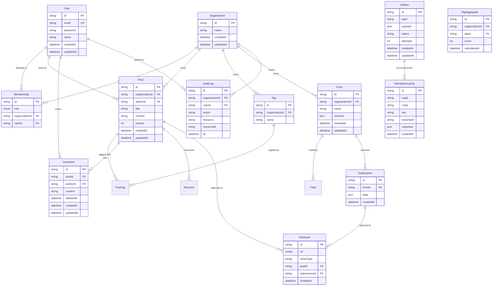
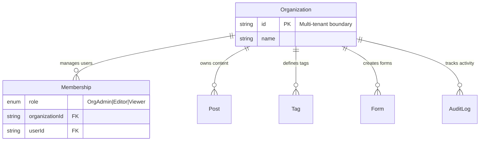
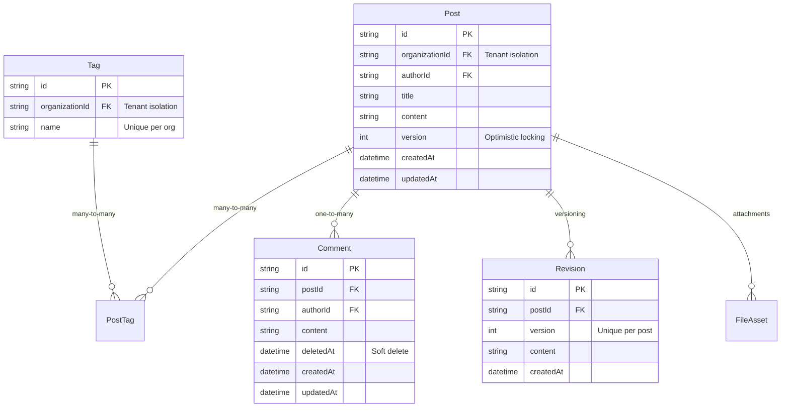
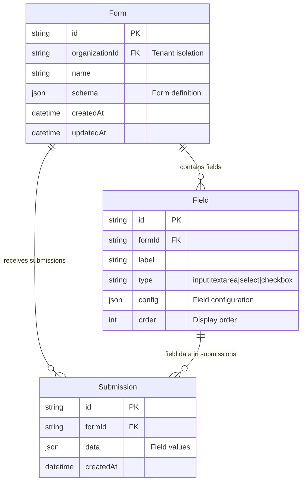
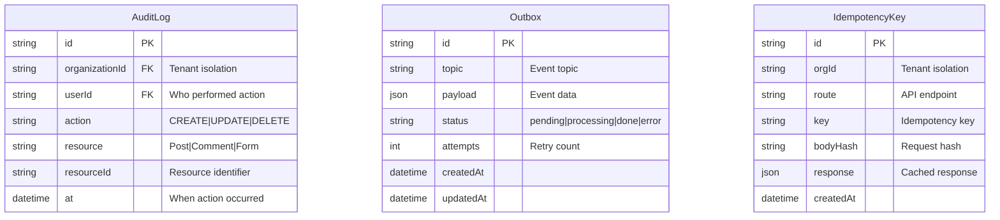

# Database ERD Overview - Portfolio Grade

## High-Level System Architecture

## Multi-Tenant Architecture

## Content Management System

## Form Builder System

## Audit & Event System

## Key Design Patterns

### 1. Multi-Tenancy

- Every entity (except system tables) includes `organizationId`
- Tenant isolation enforced at database level
- Unique constraints scoped to organization

### 2. RBAC (Role-Based Access Control)

- Three-tier role system: OrgAdmin > Editor > Viewer
- Membership table manages user-organization relationships
- Role hierarchy enforced in application logic

### 3. Soft Deletes

- Comments use `deletedAt` for soft deletion
- Allows restoration of accidentally deleted content
- Maintains referential integrity

### 4. Optimistic Locking

- Posts have `version` field for conflict resolution
- Prevents concurrent modification issues
- Enables collaborative editing

### 5. Polymorphic Relationships

- FileAsset can be attached to Posts or Submissions
- Flexible file attachment system
- Single table for all file types

### 6. Event Sourcing

- Outbox pattern for reliable event publishing
- Idempotency keys prevent duplicate operations
- Audit trail for all system actions

### 7. Background Processing

- TagAggregate for materialized views
- BullMQ integration for async processing
- Performance optimization through aggregation
