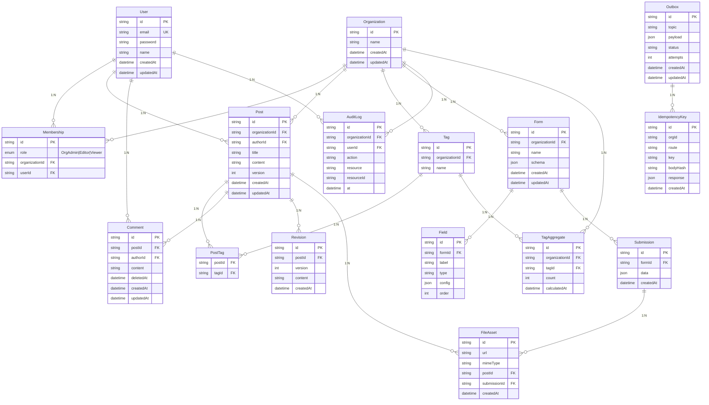

# System Architecture & Database Integration

## High-Level System Architecture

```mermaid
graph TB
    subgraph "Frontend Layer"
        Admin[Admin App<br/>React + Vite<br/>Port 4200]
        Portal[Portal App<br/>React + Vite<br/>Port 4201]
    end

    subgraph "API Layer"
        API[NestJS API<br/>Port 3000]
        Auth[JWT Authentication]
        RBAC[Role-Based Access Control]
        Tenant[Multi-Tenant Guard]
    end

    subgraph "Business Logic"
        Posts[Post Management]
        Forms[Form Builder]
        Comments[Comment System]
        Files[File Management]
        Audit[Audit Logging]
    end

    subgraph "Infrastructure"
        Redis[(Redis<br/>Cache & Queue)]
        BullMQ[Background Jobs]
        Outbox[Event Processing]
    end

    subgraph "Database Layer"
        PostgreSQL[(PostgreSQL<br/>Port 5432)]

        subgraph "Core Tables"
            Org[Organizations]
            Users[Users]
            Memberships[Memberships]
        end

        subgraph "Content Tables"
            PostsTable[Posts]
            Tags[Tags]
            PostTags[PostTags]
            Comments[Comments]
            Revisions[Revisions]
        end

        subgraph "Form Tables"
            Forms[Forms]
            Fields[Fields]
            Submissions[Submissions]
        end

        subgraph "System Tables"
            Files[FileAssets]
            AuditLogs[AuditLogs]
            OutboxTable[Outbox]
            Idempotency[IdempotencyKeys]
            TagAgg[TagAggregates]
        end
    end

    %% Frontend to API
    Admin --> API
    Portal --> API

    %% API to Business Logic
    API --> Auth
    API --> RBAC
    API --> Tenant
    API --> Posts
    API --> Forms
    API --> Comments
    API --> Files
    API --> Audit

    %% Business Logic to Infrastructure
    Posts --> Redis
    Forms --> Redis
    Comments --> Redis
    Audit --> Outbox

    %% Infrastructure to Database
    Redis --> PostgreSQL
    BullMQ --> PostgreSQL
    Outbox --> PostgreSQL

    %% API to Database
    API --> PostgreSQL

    %% Database Relationships
    Org --> Memberships
    Users --> Memberships
    Org --> PostsTable
    Users --> PostsTable
    PostsTable --> PostTags
    Tags --> PostTags
    PostsTable --> Comments
    Users --> Comments
    PostsTable --> Revisions
    Org --> Forms
    Forms --> Fields
    Forms --> Submissions
    PostsTable --> Files
    Submissions --> Files
    Org --> AuditLogs
    Users --> AuditLogs
    Org --> TagAgg
    Tags --> TagAgg
```



## Database Schema Relationships



## Data Access Patterns

### 1. Multi-Tenant Queries

```sql
-- All queries include organization filter
SELECT * FROM posts WHERE organizationId = ? AND ...
SELECT * FROM tags WHERE organizationId = ? AND ...
SELECT * FROM forms WHERE organizationId = ? AND ...
```

### 2. RBAC Authorization

```sql
-- Check user membership and role
SELECT m.role FROM memberships m
WHERE m.userId = ? AND m.organizationId = ?
```

### 3. Content Relationships

```sql
-- Get post with tags and comments
SELECT p.*, t.name as tag_name, c.content as comment_content
FROM posts p
LEFT JOIN post_tags pt ON p.id = pt.postId
LEFT JOIN tags t ON pt.tagId = t.id
LEFT JOIN comments c ON p.id = c.postId
WHERE p.organizationId = ? AND c.deletedAt IS NULL
```

### 4. Form Submissions

```sql
-- Get form with fields and submissions
SELECT f.*, fi.label, fi.type, s.data, s.createdAt
FROM forms f
LEFT JOIN fields fi ON f.id = fi.formId
LEFT JOIN submissions s ON f.id = s.formId
WHERE f.organizationId = ?
ORDER BY fi.order, s.createdAt DESC
```

## Performance Optimization

### Index Strategy

- **Tenant Indexes**: All tables have `(organizationId, ...)` composite indexes
- **Time-based Indexes**: `createdAt`, `updatedAt` for pagination
- **Foreign Key Indexes**: All FK columns indexed for joins
- **Unique Constraints**: Prevent data integrity issues

### Caching Strategy

- **Redis**: Session storage, rate limiting, temporary data
- **Application Cache**: Frequently accessed data (user roles, org settings)
- **Materialized Views**: TagAggregate for analytics

### Background Processing

- **BullMQ**: Async operations (file processing, notifications)
- **Outbox Pattern**: Reliable event delivery
- **Retry Logic**: Exponential backoff for failed operations
